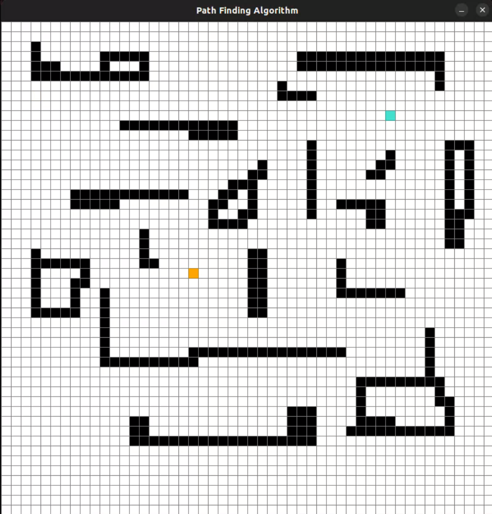
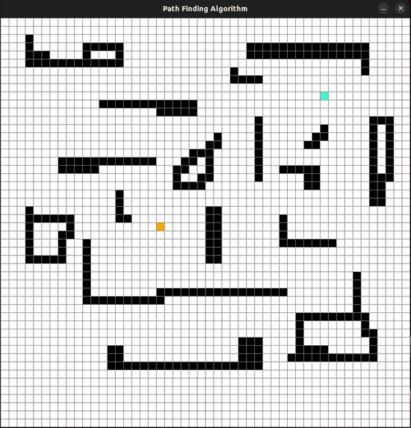
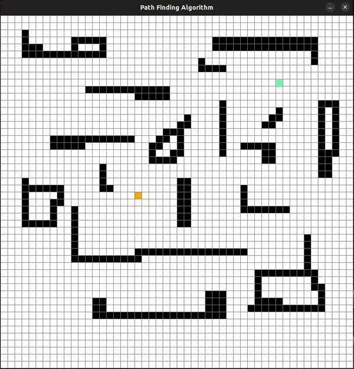
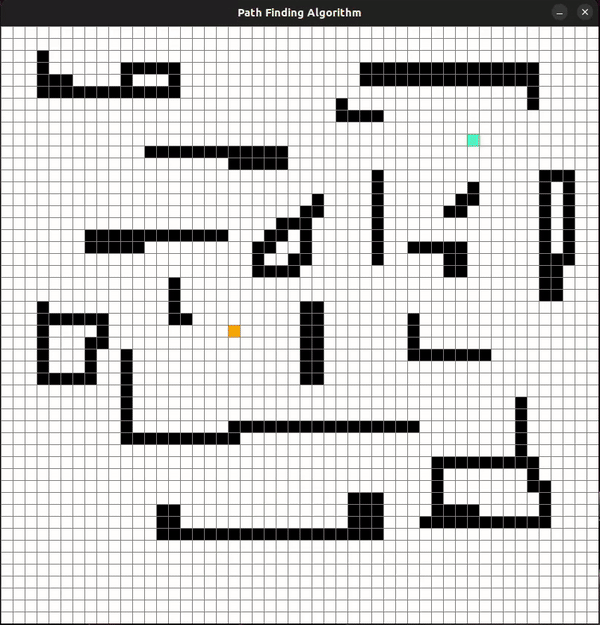

# path_finding
Path planning with different graph algorithms in 2dgrid using pygame.     
- Repository Structure
```bash
├── media/
│   ├── astar.gif
│   ├── bfs.gif
│   ├── dfs.gif
│   ├── dijkstra.gif
│   ├── gridMap.png           
│   └── path_plan_demo.mp4     # demonstration of using the plan_path.py file
├── path_plan_algorithms/
│   ├── astar.py                            # A* algo
│   ├── bfs.py                              # BFS algo  
│   ├── dfs.py                              # DFS algo
│   ├── dijkstra.py                       # Dijkstra algo
│   └── pygame_visualize.py      # visualizing grid & colors on pygamw window
├── path_plan.py                         # main file to run the project
└── README.md
```

## Pre-requisites:
- python 3.10.12
- pygame 2.6.1    

Install *pygame* in your system
```bash
pip3 install pygame==2.6.1
```

## Usage:    
- Clone this repo in your system

```bash
cd ~
git clone https://github.com/ab31mohit/path_finding.git
```

- Run the *path_plan.py* file to execute the program

```bash
cd ~/path_finding
python3 path_plan.py
```

## Results:

`ORANGE` color --> `START` node      
`TURQUOISE` color --> `END` node    
`PURPLE` color --> `Path`

<!-- <div align="left">
    <div style="display: inline-block; text-align: center; margin: 10px;">
        
        <p>Grid Map after adding osbtacles & (start, end) point</p>
    </div> -->

<!-- GIF Demonstrations -->
<div align="left">
    <div style="display: inline-block; text-align: center; margin: 10px;">
        
        <p>path planning with A*</p>
    </div>
    <div style="display: inline-block; text-align: center; margin: 10px;">
        
        <p>path planning with dijkstra</p>
    </div>
</div>      
<div align="left">
    <div style="display: inline-block; text-align: center; margin: 10px;">
        
        <p>path planning with BFS</p>
    </div>
    <div style="display: inline-block; text-align: center; margin: 10px;">
        
        <p>path planning with DFS</p>
    </div>
</div>

## Demonstration:
Here is a video that demonntrates how to use the instructions in *plan_path.py* file for    
- defining (start, end) points
- creating obstacles
- running different algorithms
- clearing pygame window    

https://github.com/user-attachments/assets/4f89df0d-a8c4-452c-a325-f2250b304ec8